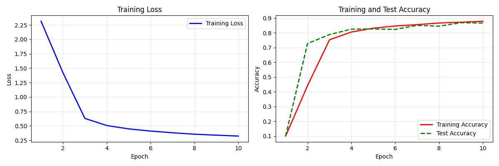

# The-performance-of-LeNet-on-the-Fashion-MNIST-dataset
Python | Deep Learning | Chapter 06 Convolutional Neural Network (CNN)
# LeNet在Fashion‐MNIST数据集上的表现

LeNet在Fashion‐MNIST数据集上的表现，《动手学深度学习》这本书的“6.6 卷积神经网络（LeNet）”实现以及代码解析。

## 简介

虽然卷积神经网络的参数较少，但与深度的多层感知机相比，它们的计算成本仍然很高，因为每个参数都参
与更多的乘法。通过使用GPU，可以用它加快训练。仅限于以后方便查看和学习。

### 核心技术
- **深度学习**: PyTorch
- **数据处理**: Pandas, NumPy
- **可视化**: Matplotlib

## 🛠 环境配置

### 系统要求
- **操作系统**: Windows 10/11
- **内存**: 最低8GB，推荐16GB
- **存储**: 至少2GB可用空间

### Python环境
- **Python完整版本**: 3.9.23

### 深度学习框架
- **PyTorch**: 1.11.0+cu113
- **Torchvision**: 0.12.0+cu113
- **CUDA**: 11.3
- **当前GPU**: NVIDIA GeForce RTX 2060 with Max-Q Design

### 数据科学库
- **Pandas**: 2.0.3
- **NumPy**: 2.0.3
- **Scikit-learn**: 1.6.1
- **Matplotlib**: 3.7.2

### 结果图

